# Categorical Deep Learning (CatDL)

This work represents the culmination of a multi year long, and truly inconsistent, study of category theory. 
It began with a desire to understand the depths of deep learning through a principled approach, with category theory being the final depths of exploration. 
Through my studies I understood a deep learning framework from category theoretical first principles was achievable through current paradigms, as a result this code base now exists.

CatDL is a deep learning framework built entirely from categorical axioms through a first principles approach. Rather than wrapping PyTorch with category theory, CatDL derives deep learning from first principles. 
Namely, Cartesian Reverse Differential Category (CRDC) provides composition with automatic reverse derivatives, a Cartesian Closed Category (CCC) reveals that linear layers are evaluation morphisms, the Para construction adds learnable parameters, and lenses compose the training loop. 
Backpropagation, the core of deep learning, is not implemented as an algorithm, but naturally emerges from CRDC's chain rule. 
We test our framework utilizing various categorical laws and verify the correctness of implementation.

## What is Category Theory?

Category theory studies how things connect. 
At its simplest, category theory can be though of as understanding a system by its internal connections rather than the system itself. 
A neural network, for example, is a chain of layers where information propogates forward through the system and error signals propogate backward. 
Here you do not need to understand the process within each layer to understand the complete system. Instead we only need to know that the output of one layer is the input of the next layer, and that signals can propagate back through the connections. 
Category theory makes this kind of reasoning precise. 
A category is thought of as a collection of objects linked by arrows, which represent morphisms, that can be composed in a chain on every object. 
That is the essential core of category theory: objects, arrows, composition, and identity (fundamentally all relational aspects). 
From these simple concepts, complex universal patterns that unify algebra, topology, logic, and computation emerge. 
Products let you pair objects. 
Internal homs let you treat "the space of all maps from A to B" as an object in its own right. 
Functors transition one category into another while preserving the arrow structure. 
These constructions appear everywhere, which is why category theory has been called the mathematics of compositionality itself.
In this work I consider the basic core operations of deep learning from the frist principles of category theory. 
Namely, composing layers, managing parameters, computing gradients, and orchestrating training which are all compositional.
A CRDC equips every morphism with a reverse derivative and satisfies the chain rule as an axiom, which means backpropagation is not implemented by inherited naturally. 
A CCC reveals that weight matrices are elements of an internal hom space and linear layers are evaluation morphisms. 
The Para construction lifts a base category to one with learnable parameters as objects. 
Lenses formalize forward and backward training as composable get / put pairs. 
Through each of these, structures emerge and show that every piece of a deep learning framework can be derived from categorical first principles. 
Across all 15 benchmark experiments, we shot CatDL matches vanilla PyTorch in accuracy.

## Motivation

Deep learning frameworks solve four fundamental problems. 
Namely, layer composition, parameter management, gradient computation, and training orchestration through the following engineering conventions. 
`nn.Sequential` as a list, `nn.Module` trees hold parameters, autograd traces a runtime tape, and training is a forward and backward loop. 
These conventions have proven to work extensively well and the fundamental mathematics have been studied for decades, but they carry no structural guarantees. 
Particularly, that composition associativity is assumed.
However, Category theory offers a different path. 
In a CRDC, composition is associative, backpropagation is the chain rule, and parameter boundaries are explicit by product structure. 
CatDL fundamentally explores and shows the practicality of building a deep learning framework from scratch where every component is a categorical construction?

## Core Concepts

### Euc: The Base Category (CRDC + CCC)

The foundation of this approach is a CRDC over Euclidean space. 
Objects are $\mathbb{R}^n$, or like nested products such as $\mathbb{R}^3 \times (\mathbb{R}^2 \times \mathbb{R}^4)$.
Every morphism $f: A \to B$ uses a forward map paired with a reverse derivative. 
This construction shows the following:

$$R\lbrack\text{id}\rbrack(x,\, \bar{y}) = \bar{y} \qquad \text{(identity rule)}$$

$$R\lbrack g \circ f\rbrack(x,\, \bar{z}) = R\lbrack f\rbrack\bigl(x,\, R\lbrack g\rbrack(f(x),\, \bar{z})\bigr) \qquad \text{(chain rule)}$$

$$R\lbrack f \times g\rbrack\bigl((a,b),\, (\bar{a},\bar{b})\bigr) = \bigl(R\lbrack f\rbrack(a,\bar{a}),\, R\lbrack g\rbrack(b,\bar{b})\bigr) \qquad \text{(product rule)}$$

The chain rule, in deep learning, is backpropagation. 
For category theory, composing two morphisms automatically chains their pullbacks in reverse order. 
Leaving no need for a separate backward pass implementation. 
Think of the CRDC as the physics engine underlying our gradient learning. 
Essentially, this means any morphism which can be composed can also be diferentiated by construction.

The Cartesian Closed structure adds an internal hom: the space of linear maps $[\mathbb{R}^m, \mathbb{R}^n]$ is itself $\mathbb{R}^{m \times n}$ the space of matrices which takes a flattened form. 
The evaluation morphism $\text{eval}: [\mathbb{R}^m, \mathbb{R}^n] \times \mathbb{R}^m \to \mathbb{R}^n$ performs vector multiplication from matricies. 
The linear layer is thus an evaluation morphism of the CCC.

This structure builds the morphisms that make neural architectures composable. 
Primarily, diagonal $x \mapsto (x, x)$ for copying activations, codiagonal $(a, b) \mapsto a + b$ for summing, projections for extracting components, and swap for reordering. 
Beautifully, this also results in things like residual connections becoming a natural categorical composition $\Delta \gg (\text{id} \times f) \gg \nabla$, yielding $x \mapsto x + f(x)$ with the correct pullback $\bar{y} \mapsto \bar{y} + R[f](x, \bar{y})$ falling out automatically.

### Para: The Parameterized Construction

Para(Euc) implements learnable parameters from the primitive fixed base. A `Para` morphism wraps a base morphism with a parameter object and an initialization functionm, essentially just forming an object. 
Parameters are honest tuples composing `f >> g >> h` which produces parameters `(p_f, (p_g, p_h))`, mirroring the categorical product exactly.
This avoids flattening into a single vector that loses structural boundaries, keeping extra information directly in the system.

```python
# Para morphism signature
# run(params, x) -> (y, pullback)
# pullback(y_bar) -> (param_grads, x_bar)
```

The below directly encodes the lens/optic pattern: the forward pass produces an output and a closure for the backward pass. 
The forgetful functor `to_mor` projects back to the base category by freezing parameters.
This produces a plain mor which only expects input to change the layer of abstraction we are working in.
The key construction is `para_from_eval`, which builds an affine layer directly from the CCC evaluation morphism. 
Parameters stay in the internal hom $[\mathbb{R}^m, \mathbb{R}^n]$, which represents the forward pass and evaluates the morphism on them as shown below:

```python
# Affine layer = CCC eval lifted into Para
# Parameters in [A, B] = R^(m*n), forward: y = x @ W.t() + b
model = Affine(784, 256) >> ReLU(256) >> Affine(256, 10)
```

### Lenses: Training as Composition

Training is formalized as a lens composition. 
A lens pairs a `get` (forward) with a `put` (backward). 
Composing a model lens with a loss lens creates a single optic where `get` runs the full forward pass and `put` runs backpropagation.

```python
step = lens_compose(model_lens(model, x), loss_lens(loss_fn, y))
loss, residual = step.get(params)          # forward
param_grads    = step.put(residual, None)  # backward
```

## Implementation

To achieve this, we organize the code into three categorical layers, the scaffold off one another.

```
euc.py          Layer 1: CRDC + CCC over Euclidean spaces. Contains: (Mor, compose, prod, diagonal, evaluate, curry)
para.py         Layer 2: Para construction. Contains: (Para, para_compose, para_from_eval, sequential)
lens.py         Layer 3: Training as optic composition. Contains: (Lens, model_lens, loss_lens, training_step)

nn.py           Neural network layers as Para morphisms. Contains: (Affine, Conv2d, ReLU, Tanh, MaxPool2d, GlobalAvgPool)

train.py        Loss functions (SoftmaxCrossEntropy), optimizers (AdamW), data loaders
test.py         33 category theory laws for  verification of approach

main.py         Entrance to run model / code base
visualize.py    Metrics tracking and plotting
benchmarks/     Here we utilize the other files to compare CatDL vs PyTorch and plot comparison results
```


## Results

The goal of CatDL is not to become SOTA, but to be a proof of concept of DL from category theoretic first principles. 
Three architectures are benchmarked across five datasets (15 experiments total) against equivalent PyTorch implementations under identical hyperparameters (25 epochs, AdamW, lr=0.0015, batch\_size=512).

### CatDL Accuracy

| Dataset | MLP | CNN | ResMLP |
|---|---|---|---|
| MNIST (10 classes) | 98.21% | **99.24%** | 97.54% |
| EMNIST Digits (10 classes) | 99.07% | **99.60%** | 98.29% |
| EMNIST Letters (26 classes) | 90.91% | **93.63%** | 89.00% |
| EMNIST Balanced (47 classes) | 83.94% | **88.01%** | 82.37% |
| CIFAR-10 (10 classes) | 51.27% | **70.86%** | 42.30% |

In our first experiment we test baselines of CatDL against different architectures and different datasets.
CNN outperforms our other two MLP models because of its inductive bias which is a categorical morphism in CatDL.


### CatDL vs PyTorch (Accuracy Delta)

| Dataset | MLP | CNN | ResMLP |
|---|---|---|---|
| MNIST | +0.14% | **+0.24%** | +0.06% |
| EMNIST Digits | -0.01% | **+0.02%** | +0.09% |
| EMNIST Letters | -0.58% | **+0.03%** | -0.27% |
| EMNIST Balanced | -0.47% | **+0.06%** | -0.83% |
| CIFAR-10 | -0.28% | **+3.35%** | -2.35% |

In our experiments we show that CatDL essentially matches the performance of Pytorch, and actually manages to make a 3.33% improvement over the pytorch baseline while models like MLPs fall behind their pytorch counterparts.
This begins to show that the principles of deep learning are on par with the construction of a category theoretic first approach. 

### Training Time Comparison

| Dataset | MLP (CatDL / PyTorch) | CNN (CatDL / PyTorch) | ResMLP (CatDL / PyTorch) |
|---|---|---|---|
| MNIST | 44.0s / 43.5s (1.01x) | 73.7s / 48.1s (1.53x) | 47.4s / 45.1s (1.05x) |
| EMNIST Digits | 160.6s / 146.2s (1.10x) | 267.1s / 149.5s (1.79x) | 178.7s / 161.2s (1.11x) |
| EMNIST Letters | 90.8s / 86.4s (1.05x) | 112.1s / 83.2s (1.35x) | 95.4s / 87.3s (1.09x) |
| EMNIST Balanced | 74.6s / 81.8s (0.91x) | 102.9s / 78.8s (1.31x) | 87.0s / 86.4s (1.01x) |
| CIFAR-10 | 70.9s / 73.5s (0.96x) | 73.7s / 66.6s (1.11x) | 82.8s / 72.2s (1.15x) |

Interestingly, here we can see that there is a wide range of speed.
Some speed improvements using CatDl exist for MLPs, but the vast majority of results demonstrate that CatDL is slower than PyTorch.
On average PyTorch is roughly ~1.3x faster across all experiments.
This makes sense since PyTorch utilizes fast fused kernels, and CatDL has not been optimized. 
While CatDL is works, it is not efficient and better implementations may close this gap or even improve it.

---

### CNN Results

For this work, we set our CNN architecture to the following configuration: `[Conv2d >> ReLU >> MaxPool2d] x 3 >> GlobalAvgPool >> Affine` with channels [32, 64, 128] for both CatDL and PyTorch.

| CNN on MNIST | CNN on EMNIST Digits |
|---|---|
| 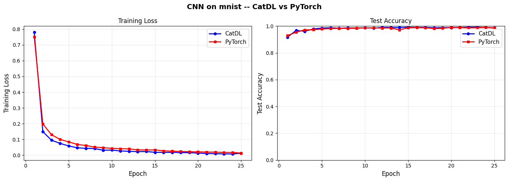 | 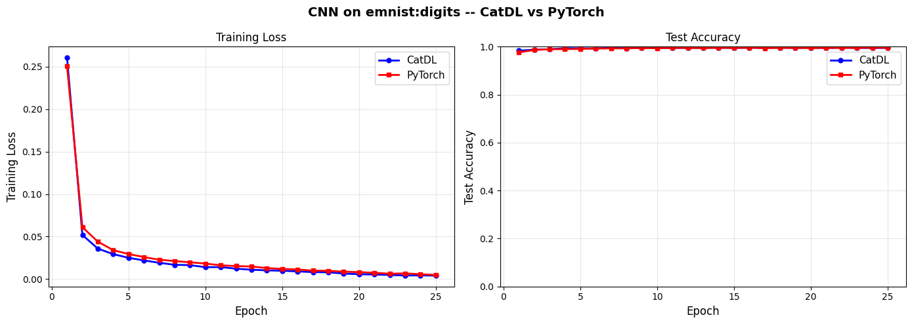 |

On MNIST and EMNIST Digits, both frameworks converge within 5 epochs. 
The loss curves for CatDL and PyTorch are almost perfectly identical with CatDL slightly edging our PyTorch.
This trend remains relatively consistent throughout the results indicating a better gradient using CatDL.


| CNN on EMNIST Letters | CNN on EMNIST Balanced |
|---|---|
| 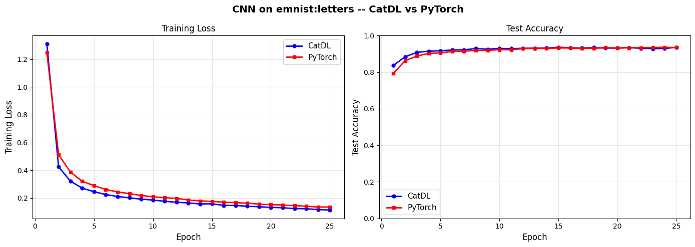 | 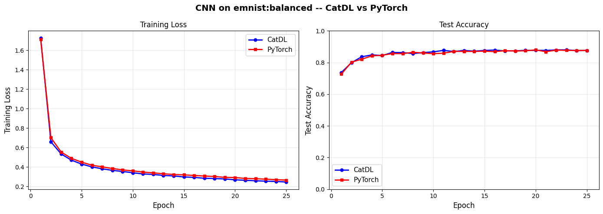 |

For the next experiment we increase the class count to see how CatDL performs with more data / variance. 
We use EMNIST with 26 classes for Letters and 47 classes for Balanced.
We show, similar to base MNIST, that CatDL stays aheaad of PyTorch across train and test sets.
On EMNIST Balanced, the curves are nearly identical. 

| CNN on CIFAR-10 |
|---|
| 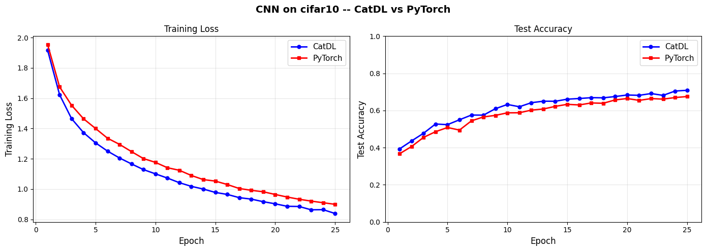 |

CIFAR-10 becomes the first meaningful difference producing the largest gaps we find from experiments.
CatDL reaches 70.86% vs PyTorch's 67.51%, a fundamental 3.35% difference after 25 epochs of training. 

---

### MLP Results

The MLP is set to `Affine >> ReLU >> Affine >> ReLU >> Affine >> ReLU >> Affine` with hidden dims [256, 128, 64] for both PyTorch and CatDL.

| MLP on MNIST | MLP on EMNIST Digits |
|---|---|
| 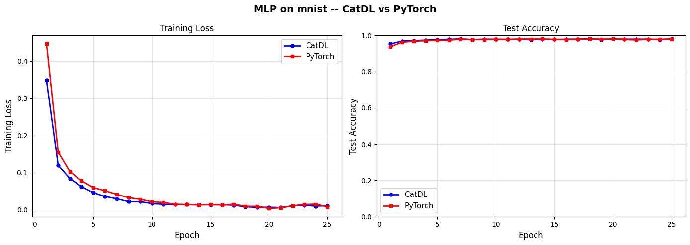 | 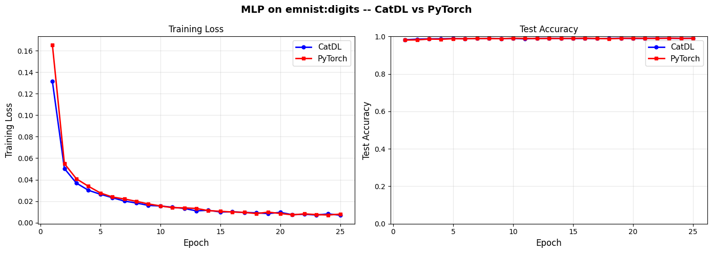 |

On MNIST and EMNIST Digits, MLP loss and accuracy curves overlap between both approaches with a marginal improvement for CatDL over PyTorch. 

| MLP on EMNIST Letters | MLP on EMNIST Balanced |
|---|---|
| 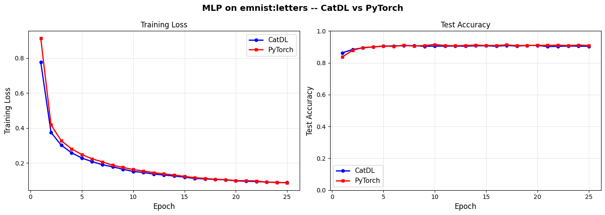 | 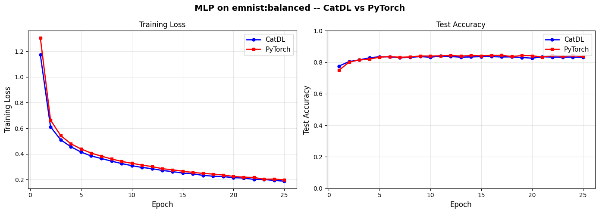 |

On the larger EMNIST splits, PyTorch holds a small accuracy advantage of about ~.50% across both datasets. 
Interestingly here, we see that the training loss is better on CatDL but the generalization is better on PyTorch.

| MLP on CIFAR-10 |
|---|
| 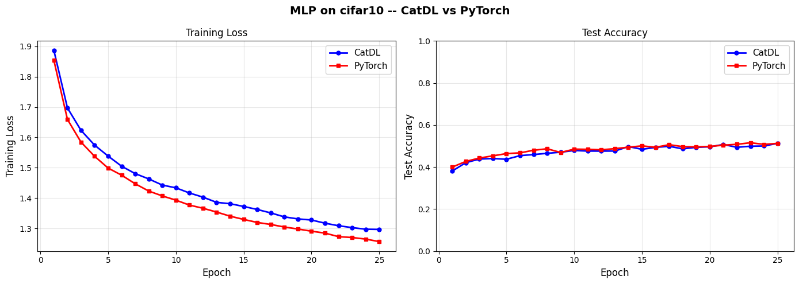 |

On CIFAR-10, both frameworks plateau around 51% well below CNN performance. 
This is a traditional and expected result for MLP on CIFAR-10 showing that our approach is structured and mirrors the fundamentals of deep learning.
This is because MLPs lack a spatially inductive bias. 
This remains one of the more interesting results in the work as our CNN CIFAR-10 approach from earlier had the reverse results.
This means that when using CNNs on multichannel data, as should be done, CatDL performs better. 
While using MLPs on multichannel data, as should not be done, PyTorch performs better.
Notably, they still produce approximately the same test accuracy.

---

### ResMLP Results

Residually connected MLPs are included here because they help to test the core functionality of CatDL and are particularly useful for extrapolating correctness.
The ResMLP is defined as: `Affine >> [ResidualBlock] x 3 >> Affine` where each block is `diagonal >> (id x (Affine >> Tanh >> Affine)) >> codiagonal`.
This is the most categorically interesting architecture because the residual connection is not a special syntax, but is derived from three structural morphisms: copy, parallel product with identity, and sum.
This are sequentially constructed with no additional bootstraps or shortcuts to make it work.

| ResMLP on MNIST | ResMLP on EMNIST Digits |
|---|---|
| 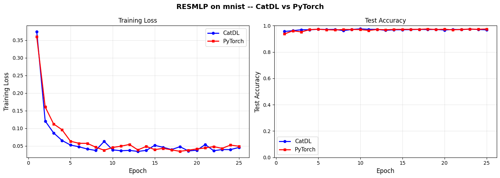 | 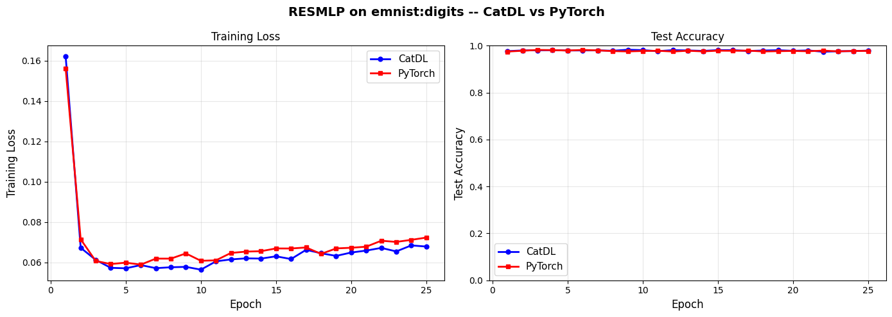 |

On MNIST, the ResMLP loss curves show more variance than our prior experiments of MLP or CNN.
The trainig curves oscillate often between CatDL and PyTorch leading. 
This is characteristic of residual architectures at these types of shallow depth, the skip connections fundamentally contribute more noise than stabilization. 
Despite this, both frameworks converge to the same accuracy at about ~97.5%. 
On EMNIST Digits, the curves are smoother and nearly identical, with CatDL holding a negligible improvement.

| ResMLP on EMNIST Letters | ResMLP on EMNIST Balanced |
|---|---|
| 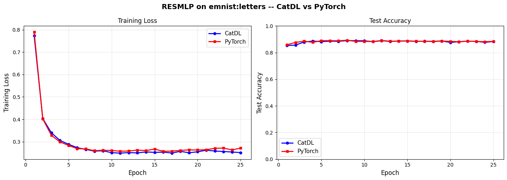 | 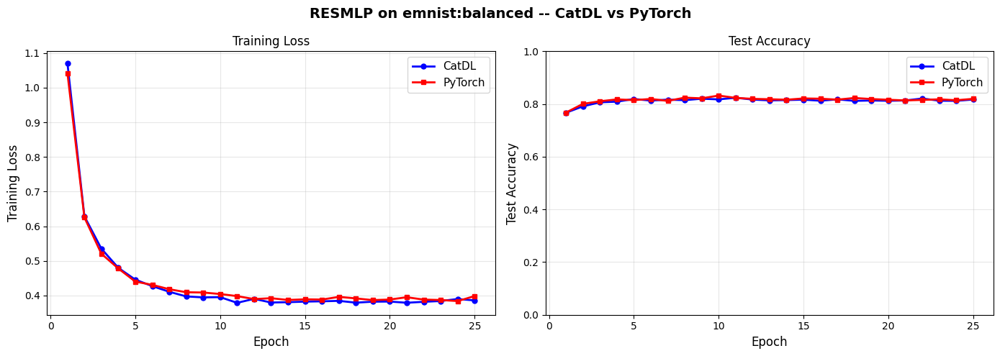 |

On EMNIST Letters and Balanced, CatDL and PyTorch track eachother closely with negligible differences across accuracy and loss.

| ResMLP on CIFAR-10 |
|---|
| 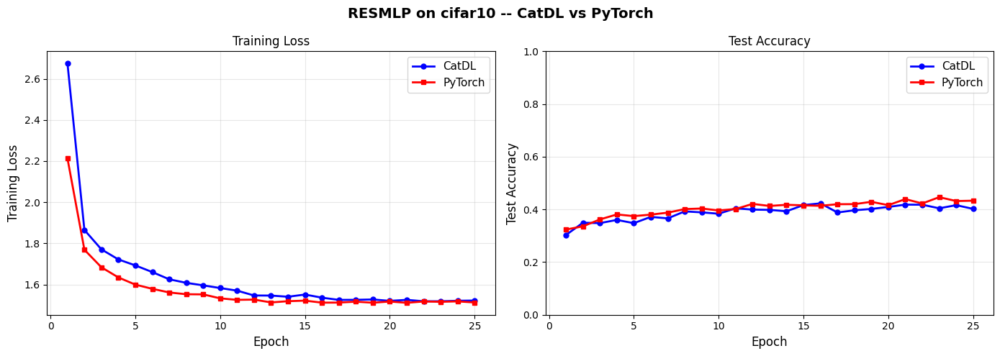 |

CIFAR-10 is the hardest setting for the ResMLP.
Both frameworks plateau around 44%, with PyTorch averaging a 2.35% advantage. 
The loss curves show both converging to similar values, but PyTorch generalizing better. 
The Tanh activation in residual blocks is chosen for its bounded output, which is important for skip connection stability.
This decision to use Tanh may also limit expressiveness compared to ReLU on data.

---

### Results Analysis

After running all these experiments a few key points stand out:

1. Categorical structure imposes no accuracy tax. Across all experiments, the mean absolute accuracy delta between CatDL and PyTorch is 0.58%. 
Eight experiments favor CatDL, seven favor PyTorch. 
There is no systematic implementation causing any gaps for the categorical abstraction in the optimization landscape.
All the gaps are within initialization variance and shows no systematic patterns.
This is the purest demonstration that the categorical abstraction are mathematically identical between frameworks, and in most cases produce marginally better results.

2. Task difficulty scales identically.
Both frameworks show the same accuracy ordering across datasets and architectures. 
The relative difficulty of each task is a property of the data and architecture. 
Our approach does not change the underlying concepts with shortcuts or added novelties.
We simply reorganize the structure of deep learning to be from a category theory approach and show better results.

### 33 Verified Categorical Laws

All category theory structural guarantees are tested and pass when compared against PyTorch for validation.

| Category | Laws Verified |
|---|---|
| CRDC axioms | Identity, associativity, product bifunctor, interchange, swap naturality/involution, diagonal-codiagonal duality, terminal, product associativity |
| CCC structure | Eval-curry adjunction, internal hom = matrix space, uncurry roundtrip |
| Vect-enrichment | Zero identity, additive commutativity, scalar distributivity |
| Differential laws | JVP-VJP duality, pullback linearity, chain rule, VJP vs autograd (affine, MLP, residual, Conv2d) |
| Para functor | Identity preservation, forgetful functor |
| Lenses | Identity, composition, product, training step vs imperative |

## Usage

Here are some example CLI arguments to run the code.

```bash
# Train CNN on MNIST
python main.py cnn mnist epochs=25 lr=0.0015 bs=512

# Train MLP on EMNIST Letters
python main.py mlp emnist_letters epochs=25

# Train ResMLP on CIFAR-10
python main.py resmlp cifar10

# Run categorical law tests
python test.py

# Run CatDL vs PyTorch benchmarks
python benchmarks/benchmark.py
```


## Conclusion

CatDL demonstrates that deep learning can be derived from categorical first principles without sacrificing performance (excluding speed, for now).
Notably the following concepts define the CatDL framework.
Backpropagation emerges from the CRDC axioms. 
Linear layers are CCC evaluation morphisms. 
Parameters are products preserving compositional structure. 
Residual connections are diagonal/codiagonal compositions. 
Training is lens composition. 
Through all of these different methods, we implement a category theoretic first principles deep learning framework called CatDL.
I hope that this implementation can be used for research and exploration of furthering deep learning through the lens of category theory.

## Citation

If you use this code in your research, please cite:

```bibtex
@software{pjm2026CatDL,
    author = {Paul J Mello},
    title  = {CatDL: Categorical Deep Learning},
    year   = {2026},
    url    = {https://github.com/pauljmello/CatDL-Categorical-Deep-Learning}
}
```

## References

[1] R. Cockett, G. Cruttwell, J. Gallagher, J.-S. Lemay, B. MacAdam, G. Plotkin, D. Pronk. "Reverse Derivative Categories." *CSL 2020*.

[2] B. Fong, D. Spivak, R. Tuyeras. "Backprop as Functor: A compositional perspective on supervised learning." *LICS 2019*.

[3] G. Wilson, G. Cruttwell. "The Para Construction as a Distributive Law." *2024*.

[4] B. Gavranovic. "Fundamental Components of Deep Learning: A category-theoretic approach." *PhD Thesis, 2024*.

[5] M. Riley. "Categories of Optics." *2018*.
